# ATLAS TileCal Linear Energy Reconstruction

GSoC 2026 evaluation test for CERN-HSF: AI-Accelerated Reconstruction for the
ATLAS Tile Calorimeter at the HL-LHC.

### Evaluation Test Results: Accepted

## Problem

Reconstruct the target signal `ene_lo[n]` from 7 consecutive digital samples
using a **linear algorithm** (weighted sum + bias), inspired by Optimal
Filtering (OF) as used in real TileCal reconstruction.

> Note: The brief mentions 8 samples, but the provided shards contain 7-sample
> windows (`X[N, 2, 7]`), consistent with TileCal's standard 7-sample OF.

## Project Structure

```
atlas-tilecal-linear-reconstruction/
  data/                 # PyTorch .pt shards (train/val/test splits)
  src/
    io.py               # Data loading and denormalization
    exploration.py       # Sanity checks and exploratory plots
    pulse_shape.py       # Template pulse and noise covariance estimation
    of_linear.py         # OF-style weight derivation
    regression.py        # Data-driven ordinary least squares (OLS)
    eval_metrics.py      # Figures of merit and plotting
    main.py              # End-to-end pipeline
  explore.py             # Secondary model ablations (ElasticNet, Polynomial, High-gain)
  results/
    figs/                # Generated plots
    metrics.json         # Scalar metrics
  atlas_tilecal_report.pdf   # Final report
  requirements.txt
```

### Dataset
The algorithm expects PyTorch `.pt` shards in the `data/` directory:
- `data/train.pt` (used for template/noise estimation and OLS training)
- `data/val.pt` (used for hyperparameter tuning)
- `data/test.pt` (used for the final reported metrics)

```bash
pip install -r requirements.txt
```

## Usage

```bash
python -m src.main --data-dir data/ --results-dir results/
```

This runs the full pipeline: loads data, estimates the pulse template and noise
covariance, computes OF-style weights, trains an ordinary least squares (OLS) baseline, and
produces the three required figures of merit on the test set.

## Deliverables
Final reported metrics on the **test set** (N=114,502):

| Metric | All Events | Signal-Only ($E > 10$ MeV) |
| :--- | :--- | :--- |
| **Mean Relative Bias** | 0.0607 | **-0.0097** |
| **RMS Relative Error** | 9.7134 | **0.4546** |

The full analysis and justification are available in the project report:
#### [ATLAS TileCal Energy Reconstruction Report (PDF)](atlas_tilecal_report.pdf)

1. **Mean and RMS** of `(y_hat - y) / y` on the test sample.
2. **1D histogram** of `(y_hat - y) / y`.
3. **2D distribution** of `(y_hat - y) / y` vs `y`.

## Pipeline Visualizations

The `results/` directory contains extensive diagnostic and evaluation plots demonstrating the rigor of the reconstruction pipeline. While the final PDF report focuses on the exact evaluation metrics requested by the brief, these supplementary plots prove the full scientific methodology (e.g., data exploration, covariance extraction, and hyperparameter tuning).

<details>
<summary><b>1. Exploratory Data Analysis</b></summary>

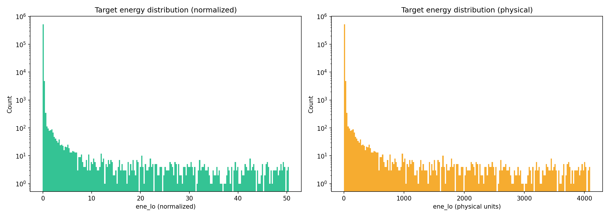
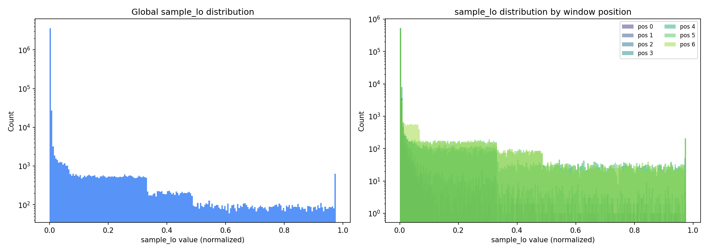
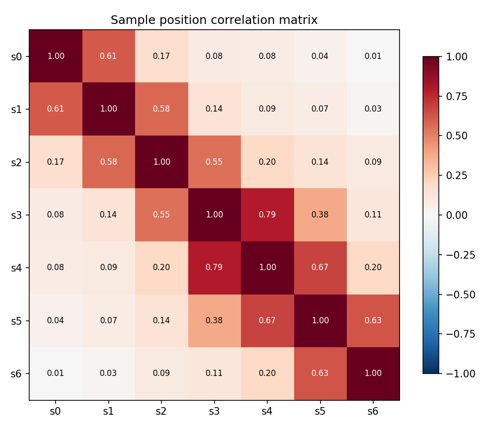
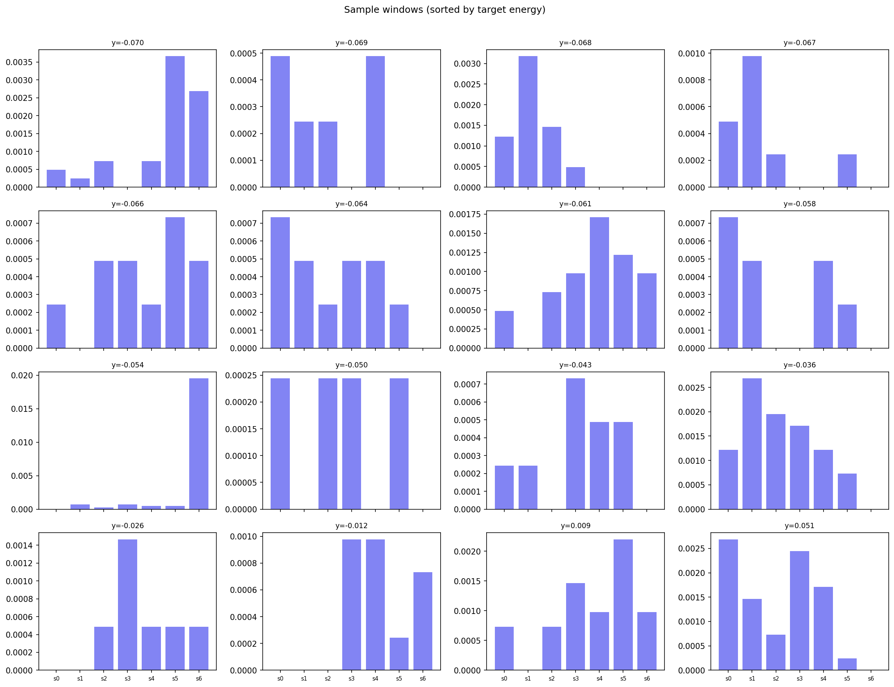
</details>

<details>
<summary><b>2. Pulse Shape & Noise Extraction</b></summary>
<br>
The baseline Optimal Filtering 2 (OF2) weights are built using this data-derived pulse template and noise covariance.
<br>

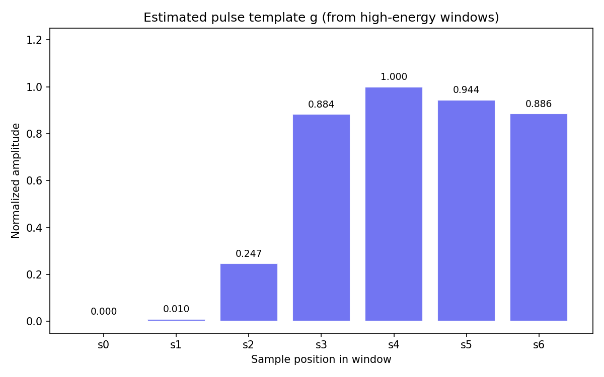
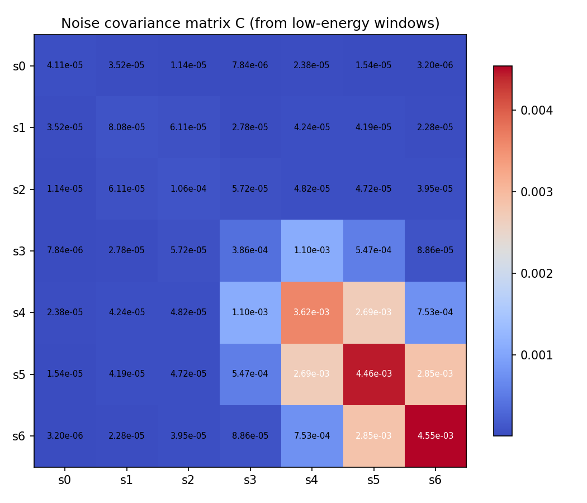
</details>

<details>
<summary><b>3. Model Tuning & Weights</b></summary>

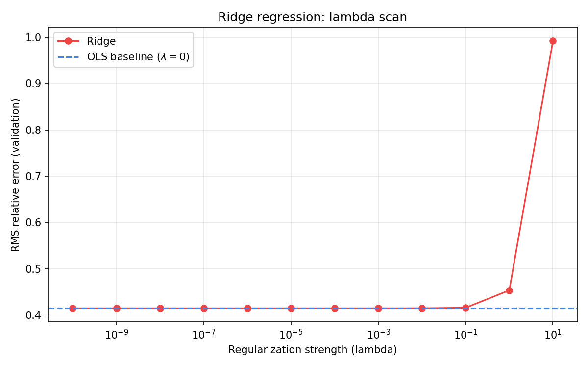
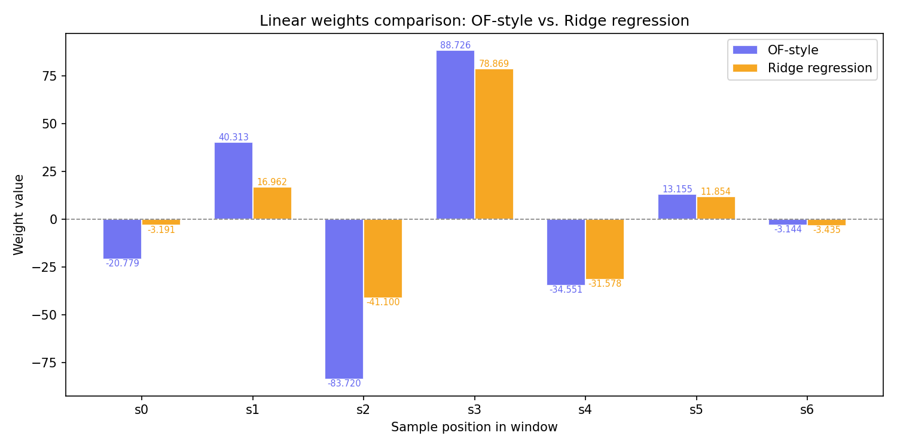
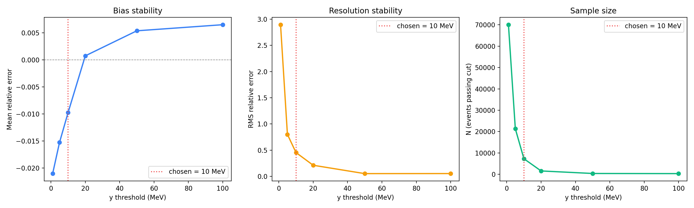
</details>

<details>
<summary><b>4. Final Test Set Deliverables</b></summary>

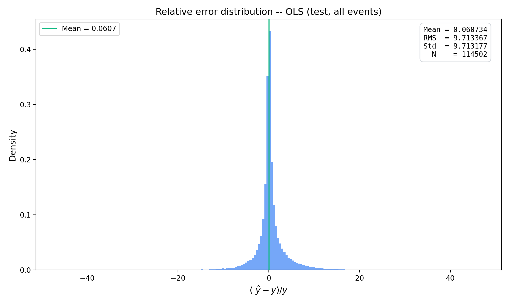
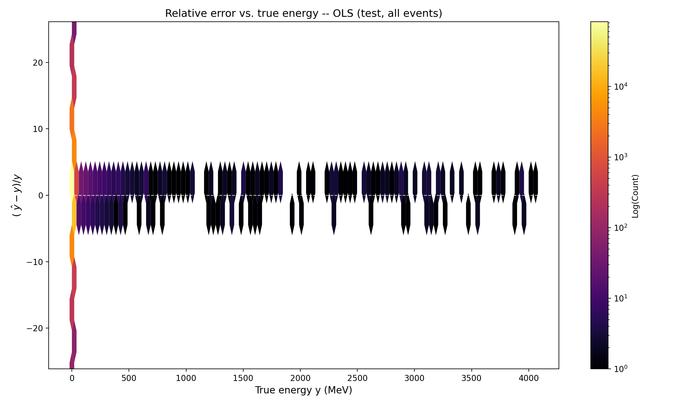
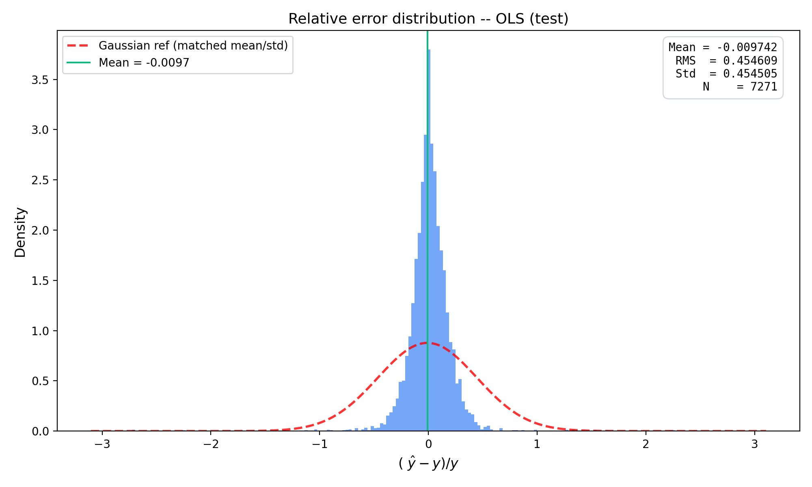
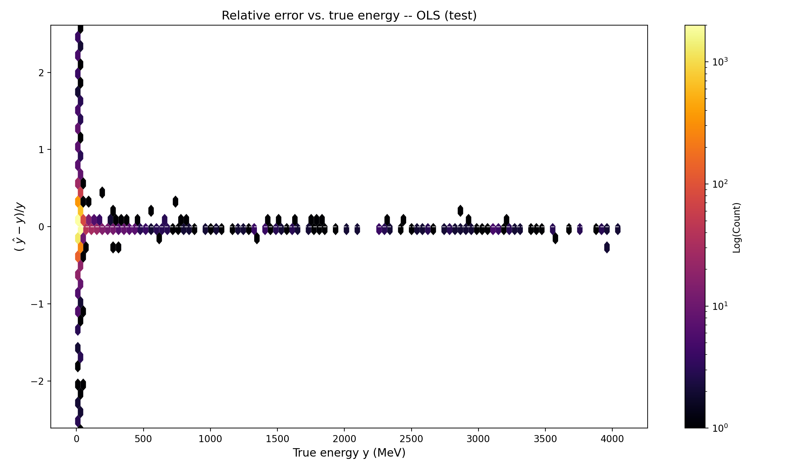
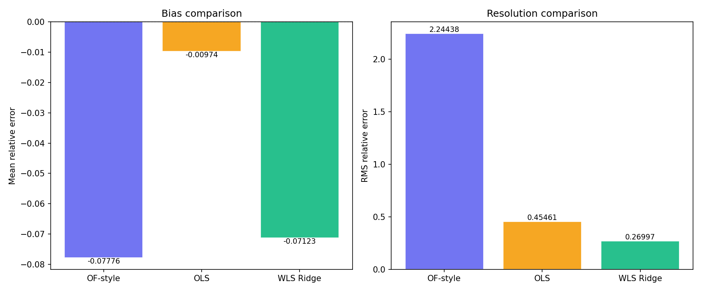
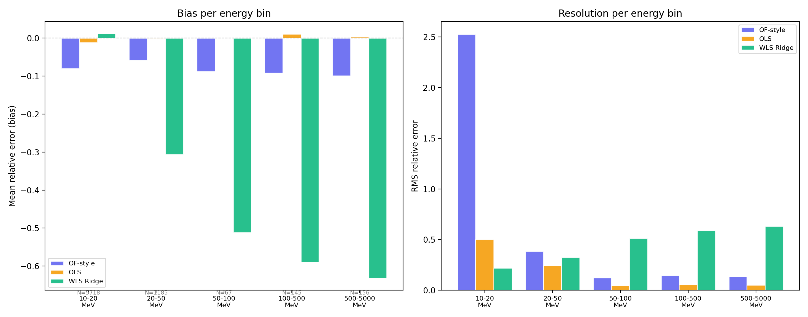
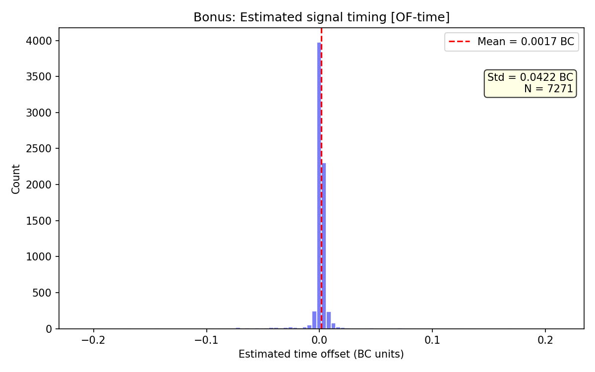
</details>

## References

```bibtex
```bibtex
@inproceedings{curcio2025,
      title={Machine Learning-Based Energy Reconstruction for the ATLAS Tile Calorimeter at HL-LHC}, 
      author={Francesco Curcio},
      year={2025},
      eprint={2502.19323},
      archivePrefix={arXiv},
      primaryClass={physics.ins-det},
      url={https://arxiv.org/abs/2502.19323},
      note={Submitted to SciPost Physics Proceedings (EuCAIFCon2025)}
}

@inproceedings{oliveira2020,
    author={Oliveira Gonçalves, D.},
    title={Energy reconstruction of the ATLAS Tile Calorimeter under high pile-up conditions using the Wiener filter},
    booktitle={Journal of Physics: Conference Series},
    volume={1525},
    number={1},
    pages={012092},
    year={2020},
    doi={10.1088/1742-6596/1525/1/012092}
}

@techreport{fullana2005,
      author        = "Fullana, E and others",
      title         = "{Optimal Filtering in the ATLAS Hadronic Tile Calorimeter}",
      institution   = "CERN",
      reportNumber  = "ATL-TILECAL-2005-001",
      year          = "2005",
      url           = "https://cds.cern.ch/record/813354"
}
```